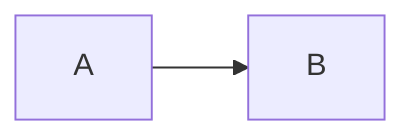

# mermaid-ast

[](https://www.npmjs.com/package/mermaid-ast)
[](https://jsr.io/@emily/mermaid-ast)
[](https://randomlabs.ai)

Parse and render Mermaid diagrams to/from AST (Abstract Syntax Tree).

This library provides a way to programmatically work with Mermaid diagrams by parsing them into a structured AST and rendering them back to Mermaid syntax. It uses the official mermaid.js JISON parsers to ensure compatibility.

## Features

- **Parse** Mermaid diagrams into typed AST structures
- **Render** ASTs back to valid Mermaid syntax
- **Round-trip guarantee**: `render(parse(text))` produces semantically equivalent diagrams
- **Full TypeScript support** with comprehensive type definitions
- **Cross-runtime support**: Works in Bun, Node.js, and Deno

## Supported Diagram Types

| Diagram Type | Parse | Render | Wrapper | Idempotence | Notes |
|--------------|-------|--------|---------|-------------|-------|
| Flowchart (`flowchart`, `graph`) | ✅ | ✅ | ✅ `Flowchart` | 95 | Chain ops, subgraphs, graph traversal |
| Sequence (`sequenceDiagram`) | ✅ | ✅ | ✅ `Sequence` | 14 | Actors, messages, control flow blocks |
| Class (`classDiagram`) | ✅ | ✅ | ✅ `ClassDiagram` | 10 | Classes, relations, namespaces |
| State (`stateDiagram`) | ✅ | ✅ | ✅ `StateDiagram` | 8 | States, transitions, composites |
| ER Diagram (`erDiagram`) | ✅ | ✅ | ✅ `ErDiagram` | 5 | Entities, relationships, attributes |
| Gantt (`gantt`) | ✅ | ✅ | ✅ `Gantt` | 3 | Tasks, sections, dependencies |
| Mindmap (`mindmap`) | ✅ | ✅ | ✅ `Mindmap` | 2 | Nodes, tree traversal |
| Journey (`journey`) | ✅ | ✅ | ✅ `Journey` | 2 | Sections, tasks |
| Timeline (`timeline`) | ✅ | ✅ | ✅ `Timeline` | 2 | Sections, periods, events |
| Sankey (`sankey-beta`, `sankey`) | ✅ | ✅ | ✅ `Sankey` | 2 | Nodes, links, flow queries |
| Quadrant (`quadrantChart`) | ✅ | ✅ | ✅ `Quadrant` | 2 | Points, axes, quadrant queries |
| XY Chart (`xychart-beta`) | ✅ | ✅ | ✅ `XYChart` | 2 | Bar/line charts, axes, data series |
| Kanban (`kanban`) | ✅ | ✅ | ✅ `Kanban` | 1 | Columns, tickets, metadata |
| Requirement (`requirementDiagram`) | ✅ | ✅ | ✅ `Requirement` | 2 | Requirements, elements, relationships |
| Block (`block-beta`) | ✅ | ✅ | ✅ `Block` | 1 | Blocks, edges, composites, styling |
| Pie (`pie`) | ✅ | ✅ | ✅ `Pie` | 2 | Sections, title, showData (async Langium parser) |
| Git Graph (`gitGraph`) | ✅ | ✅ | ✅ `GitGraph` | 2 | Commits, branches, merges (async Langium parser) |
| C4 (`C4Context`, etc.) | ✅ | ✅ | ✅ `C4` | 2 | All 5 diagram types, elements, relationships, boundaries, styling |

**Idempotence Tests:** Number of `.input.mmd`/`.output.mmd` fixture pairs that verify `render(parse(render(parse(x)))) === render(parse(x))`. See [TEST_STANDARDS.md](./TEST_STANDARDS.md) for details.

## Installation

```bash
# Bun
bun add mermaid-ast

# npm
npm install mermaid-ast

# pnpm
pnpm add mermaid-ast
```

## Usage

### Basic Parsing and Rendering

```typescript
import { parse, render } from "mermaid-ast";

// Parse any supported diagram
const ast = parse(`flowchart LR
    A[Start] --> B{Decision}
    B -->|Yes| C[OK]
    B -->|No| D[Cancel]`);

// Render back to Mermaid syntax
const output = render(ast);
```

### Flowchart Diagrams

```typescript
import { parseFlowchart, renderFlowchart } from "mermaid-ast";

const ast = parseFlowchart(`flowchart TD
    A[Start] --> B{Is it working?}
    B -->|Yes| C[Great!]
    B -->|No| D[Debug]
    D --> B`);

// Access AST properties
console.log(ast.direction); // "TD"
console.log(ast.nodes.size); // 4
console.log(ast.links.length); // 4

// Modify the AST
ast.nodes.get("A")!.text = { text: "Begin", type: "text" };

// Render back
const output = renderFlowchart(ast);
```

### Sequence Diagrams

```typescript
import { parseSequence, renderSequence } from "mermaid-ast";

const ast = parseSequence(`sequenceDiagram
    participant A as Alice
    participant B as Bob
    A->>B: Hello Bob!
    B-->>A: Hi Alice!`);

// Access AST properties
console.log(ast.actors.size); // 2
console.log(ast.statements.length); // 2

// Render back
const output = renderSequence(ast);
```

### Class Diagrams

```typescript
import { parseClassDiagram, renderClassDiagram } from "mermaid-ast";

const ast = parseClassDiagram(`classDiagram
    class Animal {
        +String name
        +int age
        +eat()
        +sleep()
    }
    class Duck {
        +String beakColor
        +swim()
        +quack()
    }
    Animal <|-- Duck`);

// Access AST properties
console.log(ast.classes.size); // 2
console.log(ast.relations.length); // 1

// Render back
const output = renderClassDiagram(ast);
```

### Diagram Type Detection

```typescript
import { detectDiagramType } from "mermaid-ast";

detectDiagramType("flowchart LR\n  A --> B"); // "flowchart"
detectDiagramType("sequenceDiagram\n  A->>B: Hi"); // "sequence"
detectDiagramType("classDiagram\n  class Animal"); // "class"
detectDiagramType("unknown diagram"); // null
```

## Flowchart Wrapper Class (Recommended)

The `Flowchart` class provides a unified API for building, mutating, and querying flowchart diagrams. This is the recommended way to work with flowcharts programmatically.

### Creating Flowcharts

```typescript
import { Flowchart } from "mermaid-ast";

// Create empty flowchart
const f = Flowchart.create("LR");

// Parse existing diagram
const f = Flowchart.parse(`flowchart LR
    A --> B --> C`);

// Wrap existing AST
const f = Flowchart.from(existingAst);
```

### Building Flowcharts

```typescript
const diagram = Flowchart.create("LR")
  .addNode("A", "Start", { shape: "stadium" })
  .addNode("B", "Process")
  .addNode("C", "End", { shape: "circle" })
  .addLink("A", "B", { text: "begin" })
  .addLink("B", "C")
  .createSubgraph("sub1", ["B"], "Processing")
  .addClass("A", "highlight");

console.log(diagram.render());
```

### Mutating Flowcharts

```typescript
const diagram = Flowchart.parse(`flowchart LR
    A --> B --> C --> D`);

// Change node properties
diagram.setNodeText("A", "New Start");
diagram.setNodeShape("A", "diamond");

// Modify links
diagram.flipLink(0);  // Reverse direction
diagram.setLinkText(0, "label");

// Add/remove classes
diagram.addClass("B", "highlight");
diagram.removeClass("B", "highlight");

// Remove a node and reconnect neighbors
diagram.removeNode("B", { reconnect: true });
// Result: A --> C --> D
```

### Querying Flowcharts

```typescript
const diagram = Flowchart.parse(`flowchart TD
    A[Start] --> B{Decision}
    B -->|Yes| C[OK]
    B -->|No| D[Cancel]`);

// Find nodes
diagram.findNodes({ class: "highlight" });
diagram.findNodes({ shape: "diamond" });
diagram.findNodes({ textContains: "Start" });

// Get links
diagram.getLinksFrom("B");  // Outgoing links
diagram.getLinksTo("B");    // Incoming links

// Graph traversal
diagram.getReachable("A");   // All nodes reachable from A
diagram.getAncestors("C");   // All nodes that can reach C
diagram.getPath("A", "C");   // Shortest path: ["A", "B", "C"]
```

### Chain Operations (jj-style)

Inspired by [jj](https://github.com/martinvonz/jj), these operations let you manipulate chains of nodes:

```typescript
const diagram = Flowchart.create()
  .addNode("X").addNode("A").addNode("B").addNode("C").addNode("Y")
  .addLink("X", "A").addLink("A", "B").addLink("B", "C").addLink("C", "Y");

// Yank (remove) a chain and reconnect
diagram.yankChain(["A", "B", "C"]);
// Result: X --> Y

// Splice a chain between nodes
diagram.spliceChain(["A", "B"], "X", "Y");
// Result: X --> A --> B --> Y

// Reverse a chain's direction
diagram.reverseChain(["A", "B", "C"]);
// Changes A-->B-->C to A<--B<--C

// Extract a chain as a new Flowchart
const extracted = diagram.extractChain(["B", "C"]);

// Rebase nodes to a new parent
diagram.rebaseNodes(["A", "B"], "NewParent");

// Get a linear chain between two nodes
diagram.getChain("A", "D");  // ["A", "B", "C", "D"] if linear
```

### Subgraph Operations

```typescript
const diagram = Flowchart.create()
  .addNode("A").addNode("B").addNode("C")
  .createSubgraph("sub1", ["A", "B"], "Group 1")
  .createSubgraph("sub2", ["C"], "Group 2");

// Move nodes between subgraphs
diagram.moveToSubgraph(["B"], "sub2");

// Extract nodes to root level
diagram.extractFromSubgraph(["A"]);

// Merge subgraphs
diagram.mergeSubgraphs("sub1", "sub2");

// Dissolve a subgraph (keep nodes, remove grouping)
diagram.dissolveSubgraph("sub1");
```

## Other Wrapper Classes

Similar to `Flowchart`, we provide wrapper classes for other diagram types:

### ErDiagram

```typescript
import { ErDiagram } from "mermaid-ast";

const diagram = ErDiagram.create()
  .addEntity("Customer")
  .addAttribute("Customer", "id", "int", ["PK"])
  .addAttribute("Customer", "name", "string")
  .addEntity("Order")
  .addRelationship("Customer", "Order", "places", {
    fromCardinality: "one_or_more",
    toCardinality: "zero_or_more"
  });

console.log(diagram.render());
```

### Gantt

```typescript
import { Gantt } from "mermaid-ast";

const diagram = Gantt.create("Project Timeline")
  .setDateFormat("YYYY-MM-DD")
  .addSection("Planning")
  .addTask("Planning", "Research", { id: "a1", duration: "3d" })
  .addTask("Planning", "Design", { id: "a2", duration: "5d", after: "a1" })
  .addSection("Development")
  .addTask("Development", "Implementation", { duration: "10d", after: "a2" });

console.log(diagram.render());
```

### Mindmap

```typescript
import { Mindmap } from "mermaid-ast";

const diagram = Mindmap.create("Project")
  .addChild("root", "Frontend", { shape: "square" })
  .addChild("root", "Backend", { shape: "square" })
  .addChild("Frontend", "React")
  .addChild("Frontend", "CSS")
  .addChild("Backend", "API")
  .addChild("Backend", "Database");

console.log(diagram.render());
```

### Journey

```typescript
import { Journey } from "mermaid-ast";

const diagram = Journey.create("User Onboarding")
  .addSection("Discovery")
  .addTask("Discovery", "Visit website", 5, ["User"])
  .addTask("Discovery", "Read docs", 3, ["User"])
  .addSection("Signup")
  .addTask("Signup", "Create account", 4, ["User"])
  .addTask("Signup", "Verify email", 2, ["User", "System"]);

console.log(diagram.render());
```

### Timeline

```typescript
import { Timeline } from "mermaid-ast";

const diagram = Timeline.create("Company History")
  .addSection("2020s")
  .addPeriod("2020s", "2020")
  .addEvent("2020", "Company founded")
  .addEvent("2020", "First product launch")
  .addPeriod("2020s", "2023")
  .addEvent("2023", "Series A funding");

console.log(diagram.render());
```

### Sequence

```typescript
import { Sequence } from "mermaid-ast";

const diagram = Sequence.create()
  .addActor("alice", "Alice", "participant")
  .addActor("bob", "Bob", "actor")
  .addMessage("alice", "bob", "Hello Bob!", { type: "solid", arrow: "filled" })
  .addMessage("bob", "alice", "Hi Alice!", { type: "dashed", arrow: "filled" })
  .addLoop("Every minute", (loop) => {
    loop.addMessage("bob", "alice", "Ping");
  })
  .addNote("alice", "Important note", { placement: "right" });

console.log(diagram.render());
```

### ClassDiagram

```typescript
import { ClassDiagram } from "mermaid-ast";

const diagram = ClassDiagram.create()
  .addClass("Animal")
  .addAttribute("Animal", "name: string", "+")
  .addAttribute("Animal", "age: int", "-")
  .addMethod("Animal", "speak()", "+")
  .addClass("Dog")
  .addInheritance("Dog", "Animal")
  .addMethod("Dog", "bark()", "+")
  .addClass("Cat")
  .addInheritance("Cat", "Animal")
  .addMethod("Cat", "meow()", "+");

console.log(diagram.render());
```

### StateDiagram

```typescript
import { StateDiagram } from "mermaid-ast";

const diagram = StateDiagram.create()
  .addState("Idle", { description: "Waiting for input" })
  .addState("Running")
  .addState("Done")
  .addInitial("Idle")
  .addTransition("Idle", "Running", { label: "start" })
  .addTransition("Running", "Done", { label: "complete" })
  .addFinal("Done")
  .addComposite("Running", (composite) => {
    composite
      .addState("Step1")
      .addState("Step2")
      .addTransition("Step1", "Step2");
  });

console.log(diagram.render());
```

## Render Options (Pretty-Print)

All render functions accept an optional `RenderOptions` object to customize output formatting:

```typescript
import { renderFlowchart, parseFlowchart } from "mermaid-ast";
import type { RenderOptions } from "mermaid-ast";

const ast = parseFlowchart(`flowchart LR
    A[Start] --> B[Middle] --> C[End]
    classDef highlight fill:#f9f
    class A highlight`);

// Default output (4-space indent)
renderFlowchart(ast);

// Custom indent (2 spaces)
renderFlowchart(ast, { indent: 2 });

// Tab indent
renderFlowchart(ast, { indent: "tab" });

// Sort nodes alphabetically
renderFlowchart(ast, { sortNodes: true });

// Flowchart-specific: inline classes (A:::highlight instead of separate class statement)
renderFlowchart(ast, { inlineClasses: true });

// Flowchart-specific: chain links (A --> B --> C on one line)
renderFlowchart(ast, { compactLinks: true });

// Combine options
renderFlowchart(ast, {
  indent: 2,
  sortNodes: true,
  inlineClasses: true,
  compactLinks: true,
});
```

#### Available Options

| Option | Type | Default | Description |
|--------|------|---------|-------------|
| `indent` | `number \| "tab"` | `4` | Number of spaces for indentation, or `"tab"` for tabs |
| `sortNodes` | `boolean` | `false` | Sort node/actor/class declarations alphabetically |
| `inlineClasses` | `boolean` | `false` | (Flowchart only) Use `A:::className` instead of separate `class` statements |
| `compactLinks` | `boolean` | `false` | (Flowchart only) Chain consecutive links: `A --> B --> C` |

## Sankey Diagrams

Sankey diagrams show flow between nodes with weighted links.

```typescript
import { Sankey } from "mermaid-ast";

// Create programmatically
const sankey = Sankey.create()
  .addLink("A", "B", 10)
  .addLink("B", "C", 20)
  .addLink("A", "C", 5);

// Parse from Mermaid syntax
const sankey = Sankey.parse(`sankey-beta
A,B,10
B,C,20
A,C,5`);

// Query operations
sankey.getTotalFlow(); // 35
sankey.getLinksFrom("A"); // Links originating from A
sankey.findLinks({ minValue: 15 }); // Links with value >= 15

console.log(sankey.render());
```

## Quadrant Charts

Quadrant charts position data points on X-Y axes divided into four quadrants.

```typescript
import { Quadrant } from "mermaid-ast";

// Create programmatically
const chart = Quadrant.create("Priority Matrix")
  .setXAxis("Low Effort", "High Effort")
  .setYAxis("Low Impact", "High Impact")
  .setQuadrantLabels("Do First", "Plan", "Delegate", "Eliminate")
  .addPoint("Task A", 0.3, 0.8)
  .addPoint("Task B", 0.7, 0.2);

// Parse from Mermaid syntax
const chart = Quadrant.parse(`quadrantChart
    title Priority Matrix
    x-axis "Low" --> "High"
    y-axis "Low" --> "High"
    Task A: [0.3, 0.8]
    Task B: [0.7, 0.2]`);

// Query operations
chart.getPointsInQuadrant(1); // Points in top-right quadrant
chart.findPoints({ minX: 0.5, minY: 0.5 }); // High effort, high impact

console.log(chart.render());
```

## API Reference

### Core Functions

| Function | Description |
|----------|-------------|
| `parse(input: string): MermaidAST` | Parse any supported diagram |
| `render(ast: MermaidAST, options?: RenderOptions): string` | Render any supported AST |
| `detectDiagramType(input: string): DiagramType \| null` | Detect diagram type |

### Flowchart Functions

| Function | Description |
|----------|-------------|
| `parseFlowchart(input: string): FlowchartAST` | Parse flowchart diagram |
| `renderFlowchart(ast: FlowchartAST, options?: RenderOptions): string` | Render flowchart AST |
| `isFlowchartDiagram(input: string): boolean` | Check if input is flowchart |

### Sequence Diagram Functions

| Function | Description |
|----------|-------------|
| `parseSequence(input: string): SequenceAST` | Parse sequence diagram |
| `renderSequence(ast: SequenceAST, options?: RenderOptions): string` | Render sequence AST |
| `isSequenceDiagram(input: string): boolean` | Check if input is sequence |

### Class Diagram Functions

| Function | Description |
|----------|-------------|
| `parseClassDiagram(input: string): ClassDiagramAST` | Parse class diagram |
| `renderClassDiagram(ast: ClassDiagramAST, options?: RenderOptions): string` | Render class diagram AST |
| `isClassDiagram(input: string): boolean` | Check if input is class diagram |

## Supported Flowchart Features

- **Directions**: LR, RL, TB, TD, BT
- **Node shapes**: Rectangle, rounded, diamond, stadium, subroutine, cylinder, circle, asymmetric, rhombus, hexagon, parallelogram, trapezoid, double-circle
- **Link types**: Arrow, open, cross, circle
- **Link strokes**: Normal, thick, dotted
- **Link labels**: Text on connections
- **Subgraphs**: With titles and directions
- **Styling**: `classDef`, `class`, `style`, `linkStyle`
- **Interactions**: `click` handlers with callbacks or URLs

## Supported Sequence Diagram Features

- **Participants/Actors**: With aliases
- **Message types**: Solid/dashed lines, arrows/open ends, async
- **Activations**: `activate`/`deactivate`
- **Control flow**: `loop`, `alt`/`else`, `opt`, `par`, `critical`, `break`
- **Grouping**: `rect` backgrounds
- **Notes**: `note left of`, `note right of`, `note over`
- **Actor lifecycle**: `create`, `destroy`

## Design Decisions

### AST Type Discriminator

All AST nodes use a `type` field for discrimination (e.g., `type: 'flowchart'`, `type: 'sequence'`). This is consistent across all 18 diagram types.

**Note:** The `@mermaid-js/parser` (Langium-based) uses `$type` internally. For pie and gitGraph diagrams, we transform the Langium AST to use `type` for consistency with our other parsers. Users never see `$type`.

```typescript
// Our AST format (all diagram types)
interface FlowchartAST {
  type: 'flowchart';  // Discriminator field
  direction: string;
  nodes: Map<string, Node>;
  // ...
}

// Langium uses $type internally, but we transform it
// Users always see `type`, never `$type`
```

## Limitations

### Comments Not Preserved

Mermaid supports `%%` line comments, but **comments are not preserved** during parsing. The JISON parsers discard comments during lexing, so they are not included in the AST and will not appear in rendered output.



After round-trip, the comment is gone:


## Supported Class Diagram Features

- **Classes**: With labels, members (attributes and methods)
- **Visibility modifiers**: `+` (public), `-` (private), `#` (protected), `~` (package)
- **Relationships**: Inheritance (`<|--`), composition (`*--`), aggregation (`o--`), dependency (`<--`), lollipop (`()--`)
- **Line types**: Solid (`--`), dotted (`..`)
- **Cardinality**: `"1" --> "*"` relationship labels
- **Annotations**: `<<interface>>`, `<<abstract>>`, `<<service>>`, etc.
- **Namespaces**: Group related classes
- **Notes**: `note for Class "text"`
- **Direction**: `direction LR`, `direction TB`, etc.
- **Styling**: `cssClass`, `classDef`
- **Interactions**: `callback`, `link`
- **Generic types**: `class List~T~`

## Development

### Prerequisites

- [Bun](https://bun.sh/) runtime

### TODO

- [ ] Migrate existing renderers to use `doc.ts` library for consistent formatting (journey, timeline, er, gantt, mindmap, sankey, quadrant renderers currently use manual string building)

### Commands

```bash
# Install dependencies
bun install

# Run tests
bun test

# Run specific test suites
bun test tests/unit          # Unit tests
bun test tests/roundtrip     # Round-trip tests
bun test tests/compatibility # Mermaid.js compatibility tests
bun test tests/golden        # JSON golden tests (AST snapshots)

# Type checking
bun run typecheck

# Build
bun run build
```

### JSON Golden Tests

JSON golden tests validate the complete structure of parsed ASTs by comparing against canonical JSON snapshots. These tests catch structural bugs that property-based tests might miss.

**Example**: The quadrant parser had a bug where point names were stored as `{text: "A", type: "text"}` objects instead of `"A"` strings. Traditional tests only checked array length, missing this structural issue. Golden JSON makes it obvious:

```json
// CORRECT
"name": "A"

// BUGGY  
"name": {"text": "A", "type": "text"}
```

**Running golden tests:**

```bash
bun test tests/golden              # Run tests
UPDATE_GOLDEN=1 bun test tests/golden  # Regenerate snapshots
```

**Adding new test cases:**

1. Add a `.mmd` file: `tests/golden/quadrant/new-case.mmd`
2. Generate golden JSON: `UPDATE_GOLDEN=1 bun test tests/golden --test-name-pattern="new-case"`
3. Review and commit both files

**Future improvement:** Add diff support for better error messages when golden tests fail (e.g., using `jest-diff`).

### Using the Justfile

If you have [just](https://github.com/casey/just) installed:

```bash
just mermaid-ast test              # Run all tests
just mermaid-ast test-golden       # Run JSON golden tests
just mermaid-ast update-golden-json # Update golden JSON files
just mermaid-ast test-roundtrip    # Run round-trip tests
just mermaid-ast dagger-test-all   # Test in all runtimes via Dagger
just mermaid-ast sync-parsers 11.4.2  # Sync parsers from mermaid version
```

## Updating Mermaid Parsers

This library vendors JISON parsers from mermaid.js. To update to a new mermaid version:

```bash
# Sync from a specific version
bun run sync-parsers -- 11.4.2

# Or using just
just mermaid-ast sync-parsers 11.4.2
```

The sync script will:
1. Clone the specified mermaid version
2. Extract the JISON grammar files
3. Compile them to JavaScript parsers
4. Update the VERSION file
5. Run tests to verify compatibility

### Manual Update Process

If you need to update manually:

1. Check the [mermaid releases](https://github.com/mermaid-js/mermaid/releases) for the target version
2. Run the sync script with that version
3. Run the full test suite to verify compatibility
4. Review any failing tests - they may indicate breaking changes in the grammar

## Architecture

```
mermaid-ast/
├── src/
│   ├── parser/           # Diagram parsers
│   │   ├── flowchart-parser.ts
│   │   └── sequence-parser.ts
│   ├── renderer/         # AST to text renderers
│   │   ├── flowchart-renderer.ts
│   │   └── sequence-renderer.ts
│   ├── types/            # TypeScript type definitions
│   │   ├── flowchart.ts
│   │   └── sequence.ts
│   └── vendored/         # Vendored mermaid parsers
│       ├── grammars/     # Original JISON grammar files
│       └── parsers/      # Compiled JavaScript parsers
├── tests/
│   ├── unit/             # Unit tests for parser/renderer
│   ├── roundtrip/        # Round-trip verification tests
│   └── compatibility/    # Mermaid.js SVG compatibility tests
└── scripts/
    └── sync-parsers.ts   # Parser sync script
```

## License

MIT

This project includes JISON parsers from [mermaid.js](https://github.com/mermaid-js/mermaid) (MIT License, Copyright (c) 2014 - 2022 Knut Sveidqvist). See [THIRD-PARTY-NOTICES.md](./THIRD-PARTY-NOTICES.md) for details.

---

## How This Library Was Built

This library was built entirely through conversation with [Slate](https://randomlabs.ai), an AI coding assistant. Below are the prompts used:

### Initial Request

> I want a TypeScript library to parse and render Mermaid AST, with extensive unit tests, support for the entire syntax supported by the current version of mermaid-js, tests that show specifically that mermaid.js produces absolutely the same output for before-the-roundtrip and after-the-roundtrip diagrams, and documentation on how to bring itself up to date with newer versions of mermaid.js.

### Runtime & Scope

> go with bun
>
> tests in Dagger that demonstrate that it works the same in bun, deno, and node.js
>
> subset for now
>
> depend, sure (on @mermaid-js/parser)

### Parser Approach

> absolutely you must not use any regex approach whatsoever
>
> study the mermaidjs/parser package thoroughly
>
> ok please study first how mermaidjs parses diagrams and then we'll discuss
>
> ok but would you vendor the parsers and have like a script to re-vendor, or what would you do? how's it done usually?
>
> lets have a sync script ok

### Project Setup

> all these commands must be in justfile in mermaid-ast/
>
> can we make it work from the root?

### Quality Check

> ok cool now tell me if theres any tech debt or like anything halfassed

### Final Polish

> ok cool do 1 2, no need for 3, need everything in 5, need 6, need 7. make a todo list then discuss
>
> use mermaid js rendering to svg. readme should include just implemented. for (3) explain how exactly it happened

### Publishing

> create a repo in neongreen github and move the package there
>
> and make it private at first
>
> ok now finally in ~/code/mermaid-ast/AGENTS.md please document how this library was made etc. because i'm going to start a new agent there to continue work
>
> add a badge there: proudly built with Slate. and include my prompts from this convo